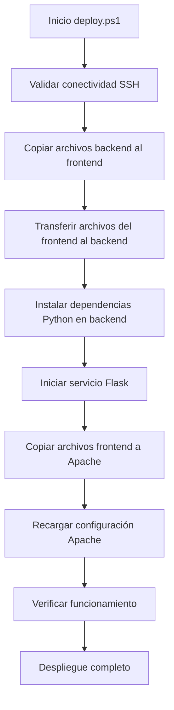

# Documentación Completa - Aplicación CRUD Distribuida

## Tabla de Contenidos
1. [Resumen Ejecutivo](#resumen-ejecutivo)
2. [Arquitectura del Sistema](#arquitectura-del-sistema)
3. [Topología de Red](#topología-de-red)
4. [Infraestructura Cloud](#infraestructura-cloud)
5. [Componentes de la Aplicación](#componentes-de-la-aplicación)
6. [Proceso de Despliegue](#proceso-de-despliegue)
7. [Configuración de Seguridad](#configuración-de-seguridad)
8. [Guía de Uso](#guía-de-uso)
9. [Troubleshooting](#troubleshooting)
10. [Anexos](#anexos)

---

## Resumen Ejecutivo

### Descripción del Proyecto
Este proyecto implementa una **aplicación CRUD (Create, Read, Update, Delete)** para gestión de usuarios, desplegada en una **arquitectura distribuida** utilizando tecnologías modernas de cloud computing y desarrollo web.

### Características Principales
- **Arquitectura Distribuida**: Frontend y Backend en servidores separados
- **Infraestructura como Código**: Desplegada con Terraform en OpenStack
- **API RESTful**: Backend Flask con base de datos SQLite
- **Interfaz Web Moderna**: Frontend responsive con HTML5, CSS3 y JavaScript
- **Proxy Transparente**: Apache configurado para comunicación seamless
- **Despliegue Automatizado**: Scripts PowerShell para deploy completo

### Tecnologías Utilizadas
- **Cloud**: OpenStack
- **IaC**: Terraform
- **Backend**: Python Flask + SQLite
- **Frontend**: HTML5 + CSS3 + JavaScript ES6
- **Servidor Web**: Apache HTTP Server + mod_proxy
- **SO**: Ubuntu 24.04 LTS
- **Automatización**: PowerShell

---

## Arquitectura del Sistema

### Diagrama de Arquitectura General

```
┌─────────────────────────────────────────────────────────────────────┐
│                           INTERNET                                  │
└─────────────────────────┬───────────────────────────────────────────┘
                          │
                          ▼
┌─────────────────────────────────────────────────────────────────────┐
│                    SERVIDOR FRONTEND                                │
│                 IP: 156.35.98.122 (Flotante)                       │
│  ┌─────────────────┐  ┌─────────────────┐  ┌─────────────────────┐ │
│  │   Apache HTTP   │  │   mod_proxy     │  │   Archivos Web      │ │
│  │   (Puerto 80)   │◄─┤   /api/ → :5000 │  │   HTML/CSS/JS       │ │
│  └─────────────────┘  └─────────────────┘  └─────────────────────┘ │
└─────────────────────────┬───────────────────────────────────────────┘
                          │ Red Interna (SSH + HTTP)
                          ▼
┌─────────────────────────────────────────────────────────────────────┐
│                    SERVIDOR BACKEND                                 │
│                 IP: 192.168.118.220 (Interna)                      │
│  ┌─────────────────┐  ┌─────────────────┐  ┌─────────────────────┐ │
│  │   Flask API     │  │   SQLite DB     │  │   Python Runtime   │ │
│  │   (Puerto 5000) │◄─┤   usuarios.db   │  │   + Dependencies    │ │
│  └─────────────────┘  └─────────────────┘  └─────────────────────┘ │
└─────────────────────────────────────────────────────────────────────┘
```

### Flujo de Datos

1. **Cliente → Frontend**: Usuario accede via navegador a `http://156.35.98.122`
2. **Frontend → Proxy**: Apache sirve archivos estáticos (HTML/CSS/JS)
3. **JavaScript → Proxy**: Peticiones AJAX a `/api/*` 
4. **Proxy → Backend**: Apache redirige a `http://192.168.118.220:5000/*`
5. **Backend → Database**: Flask procesa y consulta SQLite
6. **Database → Backend**: SQLite retorna datos
7. **Backend → Proxy**: Flask envía respuesta JSON
8. **Proxy → Frontend**: Apache retorna datos al navegador
9. **Frontend → Cliente**: JavaScript actualiza interfaz

### Patrones de Diseño Implementados

#### 1. **Proxy Pattern**
- Apache actúa como proxy reverso
- Oculta complejidad de red interna al cliente
- Permite balanceo de carga futuro

#### 2. **REST API Pattern**
- Endpoints semánticos (`/usuarios`, `/usuarios/{id}`)
- Métodos HTTP estándar (GET, POST, PUT, DELETE)
- Respuestas JSON estructuradas

#### 3. **MVC Frontend**
- **Model**: Datos de usuarios en JavaScript
- **View**: DOM + CSS styling
- **Controller**: Event handlers + AJAX calls

---

## Topología de Red

### Diagrama de Red Detallado

```
                    ┌─────────────────────────────────────┐
                    │          INTERNET/WAN               │
                    │                                     │
                    └─────────────┬───────────────────────┘
                                  │
                                  │ HTTP (Puerto 80)
                                  │
                    ┌─────────────▼───────────────────────┐
                    │       FLOATING IP POOL             │
                    │       156.35.98.122                 │
                    └─────────────┬───────────────────────┘
                                  │
                                  │ Asignación IP Flotante
                                  │
┌─────────────────────────────────▼─────────────────────────────────────┐
│                        OPENSTACK CLOUD                                │
│                                                                        │
│  ┌─────────────────────────────────────────────────────────────────┐  │
│  │                   RED INTERNA (networks_uo312167)              │  │
│  │                   Subnet: 192.168.118.0/24                     │  │
│  │                                                                 │  │
│  │  ┌─────────────────┐                ┌─────────────────────────┐ │  │
│  │  │  FRONTEND       │                │      BACKEND            │ │  │
│  │  │  crud-frontend  │◄──────────────►│   crud-backend          │ │  │
│  │  │  IP: .179       │   SSH + HTTP   │   IP: .220              │ │  │
│  │  │  (+ IP Flotante)│                │   (Solo red interna)    │ │  │
│  │  └─────────────────┘                └─────────────────────────┘ │  │
│  └─────────────────────────────────────────────────────────────────┘  │
└────────────────────────────────────────────────────────────────────────┘
```

### Configuración de Red Detallada

#### **Red Principal**
- **Nombre**: `networks_uo312167`
- **Tipo**: Red privada OpenStack
- **CIDR**: `192.168.118.0/24`
- **Gateway**: Configurado automáticamente
- **DNS**: Heredado del proveedor

#### **Asignaciones IP**
| Servidor | IP Interna | IP Flotante | Acceso |
|----------|------------|-------------|---------|
| Frontend | 192.168.118.179 | 156.35.98.122 | Internet + Red interna |
| Backend | 192.168.118.220 | - | Solo red interna |

#### **Comunicación Entre Servidores**
- **SSH**: Frontend → Backend (puerto 22)
- **HTTP**: Frontend → Backend (puerto 5000)
- **Autenticación**: Claves SSH sin contraseña

### Seguridad de Red

#### **Security Groups**

**Frontend Security Group (`crud-frontend-sg`)**
```
Regla               Puerto  Protocolo  Origen        Destino
Entrada SSH         22      TCP        0.0.0.0/0     Frontend
Entrada HTTP        80      TCP        0.0.0.0/0     Frontend
Salida Todos        *       *          Frontend      0.0.0.0/0
```

**Backend Security Group (`crud-backend-sg`)**
```
Regla               Puerto  Protocolo  Origen        Destino
Entrada SSH         22      TCP        0.0.0.0/0     Backend
Entrada API         5000    TCP        0.0.0.0/0     Backend
Salida Todos        *       *          Backend       0.0.0.0/0
```

---

## Infraestructura Cloud

### Arquitectura OpenStack

#### **Componentes Desplegados**

1. **Instancias de Compute**
   - **Frontend**: Flavor `m2_small_1` (1 vCPU, 2GB RAM, 10GB disco)
   - **Backend**: Flavor `m2_medium_2` (2 vCPU, 4GB RAM, 30GB disco)

2. **Networking**
   - **Red privada**: Conectividad interna
   - **IP flotante**: Acceso público al frontend
   - **Security groups**: Firewalls por instancia

3. **Storage**
   - **Volúmenes**: Almacenamiento persistente por instancia
   - **Imágenes**: Ubuntu 24.04 base

#### **Especificaciones de Hardware**

**Servidor Frontend**
```yaml
Instance Type: m2_small_1
vCPUs: 1
RAM: 2048 MB
Storage: 10 GB SSD
Network: 1 Gbps
OS: Ubuntu 24.04 LTS
```

**Servidor Backend**
```yaml
Instance Type: m2_medium_2  
vCPUs: 2
RAM: 4096 MB
Storage: 30 GB SSD
Network: 1 Gbps
OS: Ubuntu 24.04 LTS
```

### Código Terraform

#### **Estructura de Archivos IaC**
```
terraform/
├── main.tf              # Configuración principal y providers
├── variables.tf         # Definición de variables
├── terraform.tfvars     # Valores de variables
├── instances.tf         # Definición de instancias
├── security.tf          # Security groups y reglas
├── keypair.tf           # Claves SSH
├── floating_ip.tf       # IP flotante
├── outputs.tf           # Outputs del despliegue
├── terraform.tfstate    # Estado actual
└── terraform.tfstate.backup
```

#### **Configuración Principal (main.tf)**
```hcl
terraform {
  required_providers {
    openstack = {
      source = "terraform-provider-openstack/openstack"
      version = "~> 1.54.1"
    }
  }
}

provider "openstack" {
  # Configuración heredada de variables de entorno
}

# Datasources para obtener recursos existentes
data "openstack_images_image_v2" "ubuntu_image" {
  name = "Ubuntu-24.04"
  most_recent = true
}

data "openstack_compute_flavor_v2" "small" {
  name = "m2_small_1"
}

data "openstack_compute_flavor_v2" "medium" {
  name = "m2_medium_2"
}

data "openstack_networking_network_v2" "student_network" {
  name = "networks_uo312167"
}
```

#### **Outputs de Infraestructura**
```hcl
output "frontend_ip" {
  description = "IP interna del Frontend"
  value = openstack_compute_instance_v2.frontend.access_ip_v4
}

output "backend_ip" {
  description = "IP del Backend"
  value = openstack_compute_instance_v2.backend.access_ip_v4
}

output "frontend_floating_ip" {
  description = "IP flotante del Frontend"
  value = "156.35.98.122"
}

output "web_url" {
  description = "URL principal de la aplicación"
  value = "http://156.35.98.122"
}

output "backend_api_url" {
  description = "URL de la API Backend"
  value = "http://${openstack_compute_instance_v2.backend.access_ip_v4}:5000"
}
```

---

## Componentes de la Aplicación

### Backend - API Flask

#### **Estructura del Backend**
```
backend/
├── app.py              # Aplicación principal Flask
├── database.py         # Módulo de base de datos
├── requirements.txt    # Dependencias Python
└── usuarios.db         # Base de datos SQLite
```

#### **API REST Endpoints**

| Método | Endpoint | Descripción | Request Body | Response |
|--------|----------|-------------|--------------|----------|
| GET | `/usuarios` | Listar todos los usuarios | - | Array de usuarios |
| GET | `/usuarios/{id}` | Obtener usuario específico | - | Usuario o error 404 |
| POST | `/usuarios` | Crear nuevo usuario | JSON usuario | Usuario creado + ID |
| PUT | `/usuarios/{id}` | Actualizar usuario | JSON usuario | Usuario actualizado |
| DELETE | `/usuarios/{id}` | Eliminar usuario | - | Mensaje confirmación |

#### **Modelo de Datos**
```sql
CREATE TABLE usuarios (
    id INTEGER PRIMARY KEY AUTOINCREMENT,
    nombre TEXT NOT NULL,
    email TEXT UNIQUE NOT NULL,
    edad INTEGER
);
```

#### **Configuración Flask (app.py)**
```python
from flask import Flask, request, jsonify
from flask_cors import CORS

app = Flask(__name__)
CORS(app)  # Permitir peticiones desde el frontend

# Configuración para producción
if __name__ == '__main__':
    app.run(host='0.0.0.0', debug=True, port=5000)
```

### Frontend - Aplicación Web

#### **Estructura del Frontend**
```
frontend/
├── index.html          # Página principal
├── script.js           # Lógica de aplicación
└── style.css           # Estilos CSS
```

#### **Funcionalidades JavaScript**
- **CRUD Completo**: Create, Read, Update, Delete
- **Comunicación AJAX**: Fetch API para llamadas al backend
- **Interfaz Dinámica**: Actualización DOM sin reload
- **Validación**: Campos obligatorios y formato email

#### **Configuración de API (script.js)**
```javascript
const API_URL = '/api/usuarios';  // Proxy path

// Ejemplo de operación CREATE
async function crearUsuario(usuario) {
    const response = await fetch(API_URL, {
        method: 'POST',
        headers: {
            'Content-Type': 'application/json'
        },
        body: JSON.stringify(usuario)
    });
    return response.json();
}
```

### Configuración Apache Proxy

#### **Configuración Virtual Host**
```apache
<VirtualHost *:80>
    DocumentRoot /var/www/html
    
    ProxyRequests Off
    ProxyPreserveHost On
    
    # Proxy para API
    ProxyPass /api/ http://192.168.118.220:5000/
    ProxyPassReverse /api/ http://192.168.118.220:5000/
    ProxyPassReverse /api/ http://156.35.98.122/api/
    
    # Headers para CORS
    <Location "/api/">
        ProxyAddHeaders On
        ProxyPreserveHost On
    </Location>
    
    ErrorLog ${APACHE_LOG_DIR}/error.log
    CustomLog ${APACHE_LOG_DIR}/access.log combined
</VirtualHost>
```

---

## Proceso de Despliegue

### Script de Despliegue Automatizado

#### **deploy.ps1 - Funcionalidad**
El script `deploy.ps1` automatiza completamente el despliegue distribuido:

1. **Validación de prerrequisitos**
2. **Despliegue del backend**
3. **Despliegue del frontend**
4. **Configuración de servicios**
5. **Verificación del funcionamiento**

#### **Flujo de Despliegue Detallado**



#### **Comandos de Despliegue**

**Despliegue Completo**
```powershell
.\deploy.ps1 -Action deploy
```

**Verificación de Estado**
```powershell
.\deploy.ps1 -Action status
```

**Prueba de Conectividad**
```powershell
.\deploy.ps1 -Action test
```

### Proceso Manual Paso a Paso

#### **1. Preparación de Infraestructura**
```bash
# Desplegar infraestructura con Terraform
cd terraform
terraform init
terraform plan
terraform apply
```

#### **2. Configuración Backend**
```bash
# Conectar al backend via frontend
ssh -i id_rsa ubuntu@156.35.98.122
ssh ubuntu@192.168.118.220

# Instalar dependencias
sudo apt update
sudo apt install -y python3-pip
pip3 install flask flask-cors --break-system-packages

# Iniciar aplicación
cd /tmp/backend
nohup python3 app.py > flask.log 2>&1 &
```

#### **3. Configuración Frontend**
```bash
# Conectar al frontend
ssh -i id_rsa ubuntu@156.35.98.122

# Copiar archivos web
sudo cp /tmp/*.html /tmp/*.js /tmp/*.css /var/www/html/

# Configurar Apache proxy
sudo nano /etc/apache2/sites-enabled/000-default.conf
sudo systemctl reload apache2
```

---

## Configuración de Seguridad

### Autenticación y Autorización

#### **SSH Key Management**
- **Generación**: Claves RSA 4096 bits
- **Distribución**: Clave pública en ambos servidores
- **Acceso**: Sin contraseña, solo clave privada
- **Ubicación**: `~/.ssh/authorized_keys`

#### **Firewall Configuration**
```bash
# Ubuntu UFW rules (si está habilitado)
sudo ufw allow 22/tcp    # SSH
sudo ufw allow 80/tcp    # HTTP (frontend)
sudo ufw allow 5000/tcp  # API (backend)
```

### Seguridad de Aplicación

#### **Flask Security Headers**
```python
from flask_cors import CORS

app = Flask(__name__)
CORS(app, origins=["http://156.35.98.122"])

@app.after_request
def after_request(response):
    response.headers.add('X-Content-Type-Options', 'nosniff')
    response.headers.add('X-Frame-Options', 'DENY')
    response.headers.add('X-XSS-Protection', '1; mode=block')
    return response
```

#### **Input Validation**
```python
def crear_usuario():
    datos = request.get_json()
    
    # Validaciones
    if not datos or not isinstance(datos, dict):
        return jsonify({'error': 'Datos inválidos'}), 400
        
    nombre = datos.get('nombre', '').strip()
    email = datos.get('email', '').strip()
    
    if not nombre or not email:
        return jsonify({'error': 'Nombre y email son obligatorios'}), 400
        
    # Validación email básica
    if '@' not in email or '.' not in email:
        return jsonify({'error': 'Email inválido'}), 400
```

### Backup y Recuperación

#### **Base de Datos**
```bash
# Backup SQLite
sqlite3 usuarios.db ".backup usuarios_backup_$(date +%Y%m%d).db"

# Restauración
cp usuarios_backup_20240921.db usuarios.db
```

#### **Configuración**
```bash
# Backup configuración Apache
sudo cp /etc/apache2/sites-enabled/000-default.conf \
       /etc/apache2/sites-enabled/000-default.conf.backup

# Backup archivos aplicación
tar -czf webapp_backup_$(date +%Y%m%d).tar.gz \
    /var/www/html/ /tmp/backend/
```

---

## Guía de Uso

### Acceso a la Aplicación

1. **Abrir navegador web**
2. **Navegar a**: `http://156.35.98.122`
3. **Interfaz**: Se carga automáticamente

### Operaciones CRUD

#### **Crear Usuario**
1. Llenar formulario:
   - **Nombre**: Campo obligatorio
   - **Email**: Campo obligatorio, formato válido
   - **Edad**: Campo opcional, número entero
2. Hacer clic en **"Guardar"**
3. Usuario aparece en la lista automáticamente

#### **Leer/Listar Usuarios**
- La lista se carga automáticamente al entrar
- Actualización automática después de cada operación
- Muestra: ID, Nombre, Email, Edad, Acciones

#### **Actualizar Usuario**
1. Hacer clic en **"Editar"** junto al usuario
2. Formulario se llena con datos actuales
3. Modificar campos deseados
4. Hacer clic en **"Actualizar"**
5. Cambios se reflejan inmediatamente

#### **Eliminar Usuario**
1. Hacer clic en **"Eliminar"** junto al usuario
2. Confirmar eliminación en el diálogo
3. Usuario se remueve de la lista

### Características de la Interfaz

#### **Responsive Design**
- **Desktop**: Layout de dos columnas
- **Tablet**: Layout adaptativo
- **Mobile**: Stack vertical

#### **Feedback Visual**
- **Estados de carga**: Indicadores durante operaciones
- **Mensajes de error**: Alertas claras para problemas
- **Validación en tiempo real**: Campos obligatorios marcados

#### **Navegación**
- **Formulario siempre visible**: Parte superior de la página
- **Lista dinámica**: Parte inferior, actualización automática
- **Acciones por fila**: Botones de editar/eliminar por usuario

---

## Troubleshooting

### Problemas Comunes

#### **Error: No se cargan los datos**

**Síntomas**: Página se carga pero lista de usuarios vacía

**Diagnóstico**:
```bash
# Verificar estado del backend
ssh -i id_rsa ubuntu@156.35.98.122 'ssh ubuntu@192.168.118.220 "ps aux | grep python"'

# Verificar conectividad de API
ssh -i id_rsa ubuntu@156.35.98.122 'curl -s http://192.168.118.220:5000/usuarios'

# Verificar proxy Apache
ssh -i id_rsa ubuntu@156.35.98.122 'curl -s http://localhost/api/usuarios'
```

**Soluciones**:
1. **Reiniciar backend**: `.\deploy.ps1 -Action deploy`
2. **Verificar logs**: `ssh -i id_rsa ubuntu@156.35.98.122 'ssh ubuntu@192.168.118.220 "tail -f /tmp/backend/flask.log"'`
3. **Reiniciar Apache**: `ssh -i id_rsa ubuntu@156.35.98.122 'sudo systemctl restart apache2'`

#### **Error 400: Bad Request al guardar**

**Síntomas**: Formulario no guarda, error 400 en consola

**Diagnóstico**:
```javascript
// En consola del navegador
fetch('/api/usuarios', {
    method: 'POST',
    headers: {'Content-Type': 'application/json'},
    body: JSON.stringify({nombre: 'Test', email: 'test@test.com', edad: 25})
}).then(r => r.text()).then(console.log);
```

**Soluciones**:
1. **Verificar campos obligatorios**: Nombre y email no vacíos
2. **Validar formato email**: Debe contener @ y .
3. **Comprobar Content-Type**: Debe ser 'application/json'

#### **Error de conectividad SSH**

**Síntomas**: Timeouts en comandos SSH

**Diagnóstico**:
```bash
# Verificar conectividad básica
ping 156.35.98.122

# Verificar SSH específico
ssh -i id_rsa -o ConnectTimeout=10 ubuntu@156.35.98.122 'echo "OK"'
```

**Soluciones**:
1. **Verificar servidores encendidos** en panel OpenStack
2. **Comprobar IP flotante** asignada correctamente
3. **Validar permisos de clave SSH**: `chmod 600 id_rsa`

### Logs y Monitoreo

#### **Ubicaciones de Logs**

**Apache (Frontend)**:
```bash
sudo tail -f /var/log/apache2/error.log
sudo tail -f /var/log/apache2/access.log
```

**Flask (Backend)**:
```bash
tail -f /tmp/backend/flask.log
```

**Sistema (Ambos servidores)**:
```bash
sudo journalctl -u apache2 -f    # Frontend
sudo dmesg | tail                # Sistema
```

#### **Comandos de Diagnóstico**

**Estado de servicios**:
```bash
# Frontend
sudo systemctl status apache2
netstat -tlnp | grep :80

# Backend  
ps aux | grep python
netstat -tlnp | grep :5000
```

**Conectividad interna**:
```bash
# Desde frontend hacia backend
curl -v http://192.168.118.220:5000/usuarios
ssh ubuntu@192.168.118.220 'curl http://localhost:5000/usuarios'
```

### Procedimientos de Recuperación

#### **Restaurar Servicio Backend**
```bash
# Conectar al backend
ssh -i id_rsa ubuntu@156.35.98.122
ssh ubuntu@192.168.118.220

# Detener procesos previos
pkill -f python3.*app.py

# Reiniciar aplicación
cd /tmp/backend
nohup python3 app.py > flask.log 2>&1 &

# Verificar funcionamiento
curl http://localhost:5000/usuarios
```

#### **Restaurar Configuración Apache**
```bash
# Conectar al frontend
ssh -i id_rsa ubuntu@156.35.98.122

# Verificar configuración
sudo apache2ctl configtest

# Si hay errores, restaurar configuración básica
sudo cp /etc/apache2/sites-available/000-default.conf /etc/apache2/sites-enabled/

# Reiniciar servicio
sudo systemctl restart apache2
```

#### **Redeployment Completo**
```powershell
# Desde máquina local
.\deploy.ps1 -Action deploy
```

---

## Anexos

### Anexo A: Código Fuente Completo

#### **backend/app.py**
```python
from flask import Flask, request, jsonify
from flask_cors import CORS
import sqlite3
from database import obtener_conexion, crear_tabla

app = Flask(__name__)
CORS(app)  # Permitir peticiones desde el frontend

# Crear la tabla al iniciar
crear_tabla()

# Ruta para obtener todos los usuarios
@app.route('/usuarios', methods=['GET'])
def obtener_usuarios():
    conn = obtener_conexion()
    cursor = conn.cursor()
    cursor.execute('SELECT * FROM usuarios')
    usuarios = cursor.fetchall()
    conn.close()
    
    # Convertir a lista de diccionarios
    resultado = []
    for usuario in usuarios:
        resultado.append({
            'id': usuario[0],
            'nombre': usuario[1],
            'email': usuario[2],
            'edad': usuario[3]
        })
    
    return jsonify(resultado)

# Ruta para obtener un usuario por ID
@app.route('/usuarios/<int:id>', methods=['GET'])
def obtener_usuario(id):
    conn = obtener_conexion()
    cursor = conn.cursor()
    cursor.execute('SELECT * FROM usuarios WHERE id = ?', (id,))
    usuario = cursor.fetchone()
    conn.close()
    
    if usuario:
        return jsonify({
            'id': usuario[0],
            'nombre': usuario[1],
            'email': usuario[2],
            'edad': usuario[3]
        })
    else:
        return jsonify({'error': 'Usuario no encontrado'}), 404

# Ruta para crear un nuevo usuario
@app.route('/usuarios', methods=['POST'])
def crear_usuario():
    datos = request.get_json()
    nombre = datos.get('nombre')
    email = datos.get('email')
    edad = datos.get('edad')
    
    if not nombre or not email:
        return jsonify({'error': 'Nombre y email son obligatorios'}), 400
    
    conn = obtener_conexion()
    cursor = conn.cursor()
    
    try:
        cursor.execute(
            'INSERT INTO usuarios (nombre, email, edad) VALUES (?, ?, ?)',
            (nombre, email, edad)
        )
        conn.commit()
        usuario_id = cursor.lastrowid
        conn.close()
        
        return jsonify({
            'id': usuario_id,
            'nombre': nombre,
            'email': email,
            'edad': edad
        }), 201
    except sqlite3.IntegrityError:
        conn.close()
        return jsonify({'error': 'El email ya existe'}), 400

# Ruta para actualizar un usuario
@app.route('/usuarios/<int:id>', methods=['PUT'])
def actualizar_usuario(id):
    datos = request.get_json()
    nombre = datos.get('nombre')
    email = datos.get('email')
    edad = datos.get('edad')
    
    conn = obtener_conexion()
    cursor = conn.cursor()
    
    cursor.execute(
        'UPDATE usuarios SET nombre = ?, email = ?, edad = ? WHERE id = ?',
        (nombre, email, edad, id)
    )
    
    if cursor.rowcount == 0:
        conn.close()
        return jsonify({'error': 'Usuario no encontrado'}), 404
    
    conn.commit()
    conn.close()
    
    return jsonify({
        'id': id,
        'nombre': nombre,
        'email': email,
        'edad': edad
    })

# Ruta para eliminar un usuario
@app.route('/usuarios/<int:id>', methods=['DELETE'])
def eliminar_usuario(id):
    conn = obtener_conexion()
    cursor = conn.cursor()
    
    cursor.execute('DELETE FROM usuarios WHERE id = ?', (id,))
    
    if cursor.rowcount == 0:
        conn.close()
        return jsonify({'error': 'Usuario no encontrado'}), 404
    
    conn.commit()
    conn.close()
    
    return jsonify({'mensaje': 'Usuario eliminado correctamente'})

if __name__ == '__main__':
    app.run(host='0.0.0.0', debug=True, port=5000)
```

#### **backend/database.py**
```python
import sqlite3

def obtener_conexion():
    """Obtiene una conexión a la base de datos SQLite"""
    conn = sqlite3.connect('usuarios.db')
    return conn

def crear_tabla():
    """Crea la tabla usuarios si no existe"""
    conn = obtener_conexion()
    cursor = conn.cursor()
    
    cursor.execute('''
        CREATE TABLE IF NOT EXISTS usuarios (
            id INTEGER PRIMARY KEY AUTOINCREMENT,
            nombre TEXT NOT NULL,
            email TEXT UNIQUE NOT NULL,
            edad INTEGER
        )
    ''')
    
    conn.commit()
    conn.close()
```

### Anexo B: Configuraciones de Servidor

#### **Apache Virtual Host Completo**
```apache
<VirtualHost *:80>
    ServerName 156.35.98.122
    DocumentRoot /var/www/html
    
    # Configuración básica
    DirectoryIndex index.html
    
    # Configuración del proxy para API
    ProxyRequests Off
    ProxyPreserveHost On
    
    <Proxy *>
        Require all granted
    </Proxy>
    
    # Proxy hacia backend
    ProxyPass /api/ http://192.168.118.220:5000/
    ProxyPassReverse /api/ http://192.168.118.220:5000/
    ProxyPassReverse /api/ http://156.35.98.122/api/
    
    # Configuración específica para API
    <Location "/api/">
        ProxyAddHeaders On
        ProxyPreserveHost On
        # Opcional: timeout personalizado
        ProxyTimeout 30
    </Location>
    
    # Configuración para archivos estáticos
    <Directory "/var/www/html">
        Options -Indexes +FollowSymLinks
        AllowOverride None
        Require all granted
        
        # Headers de cache para archivos estáticos
        <FilesMatch "\.(css|js|png|jpg|gif|ico)$">
            ExpiresActive On
            ExpiresDefault "access plus 1 month"
        </FilesMatch>
    </Directory>
    
    # Logs
    ErrorLog ${APACHE_LOG_DIR}/crud_error.log
    CustomLog ${APACHE_LOG_DIR}/crud_access.log combined
    
    # Log level para debugging (cambiar a warn en producción)
    LogLevel info
</VirtualHost>
```

### Anexo C: Comandos de Administración

#### **Gestión de Servicios**
```bash
# Apache (Frontend)
sudo systemctl start apache2
sudo systemctl stop apache2
sudo systemctl restart apache2
sudo systemctl reload apache2
sudo systemctl status apache2

# Verificar configuración Apache
sudo apache2ctl configtest
sudo apache2ctl -S  # Mostrar configuración

# Flask (Backend) - Manual
cd /tmp/backend
python3 app.py  # Foreground
nohup python3 app.py > flask.log 2>&1 &  # Background

# Proceso Flask - Gestión
ps aux | grep python  # Encontrar PID
kill -9 <PID>  # Terminar proceso
pkill -f "python.*app.py"  # Terminar por nombre
```

#### **Monitoreo del Sistema**
```bash
# Uso de recursos
top
htop
free -h
df -h

# Conectividad de red
netstat -tlnp
ss -tlnp
lsof -i :80
lsof -i :5000

# Logs en tiempo real
tail -f /var/log/apache2/access.log
tail -f /tmp/backend/flask.log
journalctl -f
```

#### **Backup y Mantenimiento**
```bash
# Backup completo de aplicación
tar -czf crud_backup_$(date +%Y%m%d_%H%M).tar.gz \
    /var/www/html/ \
    /tmp/backend/ \
    /etc/apache2/sites-enabled/000-default.conf

# Backup solo base de datos
cp /tmp/backend/usuarios.db \
   /tmp/backend/usuarios_backup_$(date +%Y%m%d_%H%M).db

# Limpieza de logs (si crecen mucho)
sudo truncate -s 0 /var/log/apache2/access.log
sudo truncate -s 0 /var/log/apache2/error.log
```

---

## Conclusiones

### Logros del Proyecto

1. **Arquitectura Distribuida Funcional**: Separación exitosa de frontend y backend
2. **Automatización Completa**: Despliegue automatizado con un solo comando
3. **Infraestructura como Código**: Reproducible y versionada con Terraform
4. **Aplicación CRUD Completa**: Todas las operaciones implementadas y funcionando
5. **Configuración de Proxy Transparente**: Comunicación seamless entre capas
6. **Documentación Integral**: Proyecto completamente documentado

### Beneficios de la Solución

#### **Escalabilidad**
- Backend puede ser escalado independientemente
- Posibilidad de añadir load balancer en el futuro
- Separación clara de responsabilidades

#### **Mantenimiento**
- Actualizaciones independientes por componente
- Troubleshooting simplificado por separación
- Logs específicos por servicio

#### **Seguridad**
- Backend no expuesto directamente a internet
- Firewall a nivel de cloud provider
- Proxy como capa de protección adicional

### Posibles Mejoras Futuras

#### **Alta Disponibilidad**
- Múltiples instancias de backend
- Load balancer con health checks
- Base de datos replicada

#### **Monitoreo Avanzado**
- Métricas de aplicación con Prometheus
- Dashboards con Grafana
- Alertas automáticas

#### **Seguridad Mejorada**
- HTTPS con certificados SSL/TLS
- Autenticación de usuarios
- Rate limiting en API

#### **Performance**
- Cache con Redis
- CDN para archivos estáticos
- Optimización de consultas de base de datos

---

**Documento generado**: $(Get-Date -Format "yyyy-MM-dd HH:mm:ss")
**Proyecto**: Aplicación CRUD Distribuida
**Versión**: 1.0
**Estado**: Producción Funcional
